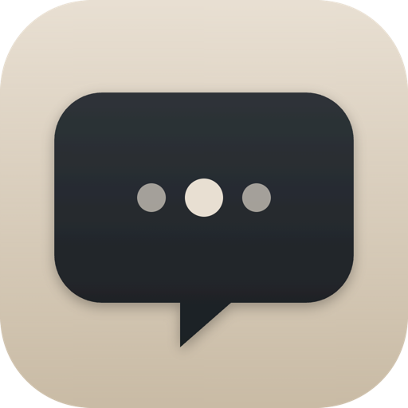

<p align="center">
  
</p>

<h1 align="center">Heard</h1>

<p align="center">
  <strong>Stop taking meeting notes. Get them automatically.</strong><br/>
  Heard is a quiet macOS menu bar app that auto-detects your meetings in Microsoft Teams, Zoom, and Webex, records them, and turns them into clean, speaker-labeled Markdown transcripts — <em>fully on-device</em>.
</p>

<p align="center">
  <a href="#install">Install</a> ·
  <a href="#why-heard">Why Heard</a> ·
  <a href="#a-look-inside">A look inside</a> ·
  <a href="#features">Features</a> ·
  <a href="#requirements">Requirements</a>
</p>

<p align="center">
  
</p>

---

## Why Heard?

**No cloud. No subscription. No sending your meetings to anyone's servers.**
Every byte of audio, every transcript, every speaker embedding lives on your Mac. Heard never makes a network call to a transcription service — because there is no transcription service. It all runs locally on Apple Silicon.

- **Zero‑click recording** — As soon as a meeting starts in Teams, Zoom, or Webex, Heard starts. When the meeting ends, you have a transcript waiting in your Documents folder.
- **Speaker-labeled transcripts** — Diarization separates each voice; once you name a speaker, Heard remembers them across every future meeting.
- **Dual‑track audio** — Heard records the system audio (the people on the call) and your microphone as separate streams, then merges them after transcription. The result is dramatically cleaner than recording a single mixed track.
- **Custom vocabulary** — Add product names, acronyms, or jargon and they'll come through correctly in both meeting transcripts and dictation.
- **Dictation, anywhere** — Press a hotkey, speak, and Heard pastes the normalized utterance into whatever app is focused — Notes, Slack, your IDE, anywhere.
- **In‑meeting notes** — A second hotkey opens a quick composer. Your typed note is timestamped to the moment you started writing it and merged into the transcript chronologically.
- **Built for macOS** — A native SwiftUI menu bar app with a calm "Paper" palette. No Electron. No tray icon misery.

### How it stacks up

|                              | Heard                       | Cloud meeting recorders         |
|------------------------------|-----------------------------|---------------------------------|
| Audio leaves your Mac        | Never                       | Always                          |
| Works offline                | Yes                         | No                              |
| Subscription                 | Free, open source           | $$$ / month                     |
| Needs a meeting bot to join  | No — runs on your machine   | Yes                             |
| Speaker memory across calls  | Yes, on-device              | Sometimes                       |
| Transcribes after you stop dictating | Yes               | Different product               |
| Custom vocabulary            | Yes                         | Sometimes                       |

---

## A look inside

### Quietly lives in your menu bar
Heard sits in the top bar and changes its icon to tell you what it's doing — pulsing while recording, a waveform while transcribing, a calm tape icon while it waits for your next call.

<p align="center">
  
  &nbsp;
  
</p>

### Outputs a clean, speaker-labeled Markdown transcript
Timestamps, merged speaker blocks, and your own typed notes interleaved at the moment you wrote them.

<p align="center">
  
</p>

### Dictates into any app
Hold `⌃⇧D` (or rebind it), speak, and release it to transcribe and paste the captured utterance. Filler words and "uhs" are stripped automatically.

<p align="center">
  
</p>

### A native settings panel built for macOS
Custom vocabulary, model management, speaker library, transcript history, and permission status all live in a single 680 × 500 settings window.

<p align="center">
  
</p>

<p align="center">
  
  &nbsp;
  
</p>

### Names new speakers with one playable clip each
The first time Heard hears someone new, it surfaces a ~10-second sample of their clearest speech and asks you who they are. After that, it remembers them.

<p align="center">
  
</p>

---

## Install

**Homebrew (recommended):**

```bash
brew tap execsumo/tap
brew install --cask heard
```

To update later, on any device: `brew upgrade --cask heard` (or just `brew upgrade`). The tap's cask is republished automatically on every release, so this always tracks latest.

**Direct download:** Grab the latest `Heard-x.x.x.dmg` from [GitHub Releases](https://github.com/execsumo/Heard/releases), open it, and drag Heard to `/Applications`.

After launching, grant Microphone (always required) and Accessibility (required for dictation, recommended for richer meeting metadata). Heard will guide you to the right System Settings pane from inside the app.

## Requirements

- macOS 15.0+
- Apple Silicon (on-device ASR and diarization models are ARM-only)

---

## Features

### Meeting Transcription
- **Meeting auto-detection** — Polls `IOPMCopyAssertionsByProcess()` every second for audio/video power assertions (`PreventUserIdleDisplaySleep` / `NoDisplaySleepAssertion` / "Call in progress"). Requires 2 consecutive hits before triggering; applies a 5-second cooldown on end. Recognises Microsoft Teams (bundle IDs `com.microsoft.teams` / `com.microsoft.teams2`, with localized-name fallbacks), Zoom (`us.zoom.xos`, localized-name fallbacks, and process-family matching), and Webex (`Cisco-Systems.Spark` / `com.cisco.webexmeetingsapp`). When Developer Mode is enabled, each poll records assertion and match diagnostics in `dict-debug.log`.
- **Meeting title extraction** — Reads the active meeting window title via the Accessibility API and strips app-specific suffixes (e.g. ` | Microsoft Teams`) for clean transcript filenames.
- **Dual-track recording** — The mic track is captured via `AVAudioEngine`; the app track is captured via `CATapDescription` + a private aggregate device + a raw AUHAL output unit. The tap collects **all supported meeting-app process-family** CoreAudio object IDs (main + renderer children) so audio from Electron/Chromium sub-processes isn't lost. Both tracks land on disk as 48 kHz WAVs and are never mixed during recording.
- **Recording reliability** — The app-audio tap self-tests after 2 seconds. If it is silent, Heard rebuilds the tap/aggregate/IOProc chain once with a fresh helper-process scan; persistent silence marks the job as mic-only and the menu bar shows "Recording (mic only)". Turning watching off during an active meeting synchronously finalizes that recording and preserves the processing state.
- **Roster scraping** — Reads Microsoft Teams participant names via Accessibility APIs every 15 s while a Teams meeting is active. Three strategies: known roster-panel identifiers → AXList/AXTable containers → window-title parsing. Filters out UI control strings (mute, raise hand, etc.).
- **On-device pipeline** — Sequential stages per job: preprocessing (48 kHz → 16 kHz mono via `AVAudioConverter`, in-memory Silero VAD trimming + `VadSegmentMap`) → Parakeet TDT V2/V3 transcription (each track separately, with CTC vocabulary boosting) → Inverse Text Normalization (punctuation formatting) → mic-bleed deduplication → LS-EEND + WeSpeaker diarization → speaker assignment and Markdown output.
- **Speaker identification** — Cosine-distance matching (default threshold 0.30, confidence margin 0.10) against a persistent speaker database, with embedding diversity management and auto-update on confident matches. The threshold is configurable in Advanced. Uses UUID-based placeholders (e.g. `Speaker_1AB23C`) to guarantee universally unique speaker profiles.
- **Cumulative transcription stats** — Every transcribed segment seamlessly increments the matched speaker's total transcribed hours and word count, which are visible in the Settings tab.
- **Roster-aware auto-naming** — When one speaker is unmatched and exactly one roster name is unclaimed, the roster name is assigned automatically without prompting.
- **Speaker naming window** — When unmatched speakers remain, a dedicated "Name Speakers" window is available from the menu bar or Speakers tab. It has a **playable audio clip** (~10 s of each speaker's clearest speech, extracted from the 48 kHz recording), a text field pre-populated with any roster suggestion, and user-paced save/skip/split/discard actions. Pending candidates persist across app restarts; there is no auto-open or countdown.
- **Custom vocabulary boosting** — CTC-based keyword boosting via `Parakeet CTC 110M` is applied to both meeting transcription and dictation. Terms are added from Settings → Recording (minimum 2 characters, max 50 terms). Falls back gracefully if the CTC model can't be loaded.
- **Persistent job queue** — `pipeline_queue.json` survives app restarts; failed jobs are re-queued on relaunch up to a lifetime cap of 6 retries. Non-retryable errors (no audio, too short) fail immediately; transient errors retry 3× per session with exponential backoff (5 s, 30 s, 5 min). User-initiated retry resets the count.
- **Long-meeting handling** — 4 h hard cap; on hit, the current recording is finalized and a fresh one starts if the meeting is still active.
- **Markdown output** — Timestamped, speaker-labeled transcripts written to a configurable output folder. Filename dates are configurable (`YYMMDD` or `YYYY-MM-DD`). Consecutive segments from the same speaker are merged into continuous blocks. When laptop mic + speakers cause remote audio to bleed into the mic track, overlapping mic segments are dropped when the app track already contains the same words.
- **Notes (in-meeting and standalone)** — Press the global hotkey (default ⌃⇧N, configurable in Settings → General) to open a floating composer. ⌘↩ saves, Esc cancels. During an active recording the note's timestamp is captured at panel-open time so a slow typer's note still anchors to the moment they reacted; notes are interleaved chronologically with spoken segments and rendered as `[mm:ss] _**Note from <Your Name>:** …_`. Survives crashes via `pipeline_queue.json`; if the meeting ends while the composer is still open, the note attaches to the just-finished job. **Outside a meeting** the same hotkey writes a standalone Markdown file (`yyyy-MM-dd_HH-mm-ss_note.md`) directly to the configured output folder — useful for capturing quick thoughts between meetings without opening a separate app.

### Dictation
- **Batch speech-to-text** — Dictation captures mic audio while active and transcribes the captured buffer on stop with FluidAudio's Parakeet TDT manager.
- **Text injection** — The normalized utterance is injected after transcription via the clipboard and a CGEvent Cmd+V paste. The field focused when dictation started is restored before paste when possible. Requires Accessibility permission.
- **Punctuation and formatting normalization** — FluidAudio's Inverse Text Normalization (ITN) and Heard's configurable formatting rules convert supported spoken forms such as "new line" and "new paragraph" before text injection.
- **Filler word stripping** — Standalone instances of "uh", "um", "er", "ah", "hmm", "hm", "uhh", "umm", "mhm" are automatically removed before injection; word boundaries and case-insensitivity apply. Keeps transcripts clean without user intervention.
- **Vocabulary boosting** — When the CTC model is downloaded, post-transcription CTC rescoring applies custom terms.
- **Global hotkey** — Default ⌃⇧D, registered via Carbon `RegisterEventHotKey`. No Accessibility permission needed for the hotkey itself, so it keeps working across ad-hoc rebuilds. Rebindable via a Record sheet in the Dictation tab. Hotkey input is validated to block forbidden system shortcuts and warn on weak combos.
- **Reliability safeguards** — Dictation checks for a first mic buffer, rebuilds a stalled input tap once, surfaces prolonged empty captures, and debounces duplicate hotkey events.
- **Accessibility revocation detection** — If the user revokes Accessibility permission mid-dictation, `AppModel.startAXPolling()` detects it every 2 seconds and gracefully stops, showing an orange banner with a "Re-grant Access…" button.
- **Floating dictation indicator (HUD)** — An optional on-screen pill at the bottom-center shows "Dictating" with a waveform icon while active (opt-in via Settings → Dictation). Appears at full opacity, dims to 35% after 2.5 seconds, and fades out on stop.
- **Toggle and push-to-talk modes** — Tap to toggle, or hold the hotkey to dictate and release to stop.
- **Model keep-alive** — ASR models stay resident for a configurable period (0 – 10 min, default 120 s) after dictation stops to avoid reload latency between utterances.

### UI
- **Visual design** — "Paper" warm palette throughout: off-white background (`#F5EFE4`), card surfaces (`#FBF7EF`), warm sidebar (`#EBE2CE`), accent blue (`#3F5C8C`). Forced light-only appearance. Custom 188 px sidebar with a `HeardMark` squircle glyph header; settings panels use `SettingsCard`/`CardRow`/`ToggleRow` card primitives rather than system `Form` groups.
- **App icon** — Ships a full 16-512 px AppIcon asset set. `bundle.sh` compiles it into `AppIcon.icns`, `Info.plist` references it via `CFBundleIconFile`, and the About tab renders the real bundle icon.
- **Menu bar icon** — SF Symbols with symbol effects: static `recordingtape` when idle, pulsing/breathing `record.circle` while recording or dictating, iterative `waveform` while processing, `exclamationmark.circle.fill` on error, `person.crop.circle.badge.exclamationmark` when waiting for speaker naming. Icon uses **accent tint** (blue) when actively capturing audio (recording or dictating) and **primary tint** (white/dark gray) otherwise. **Opacity** is 100% when the app is watching or recording, and 50% when paused (phase is dormant, not dictating, and meeting detection is off).
- **Menu bar dropdown** — 268 px wide Paper-palette panel. Current status card (dark `#2E3338` background when recording/dictating, Paper background otherwise), **Recent Meetings** list (up to 3 completed/failed jobs with click-to-open and right-click to reveal/retry/dismiss), quick actions (start dictation, open transcripts, name speakers, settings, quit), and developer-mode simulate buttons.
- **Settings window** — 680×500 with **General**, **Recording**, **Dictation**, **Speakers**, **Meetings**, **Advanced**, and **About** tabs. Advanced is hidden until enabled in General; model management lives in Advanced's "Models on Disk" section.
- **Name Speakers window** — 560×520 standalone scene with audio-clip playback per candidate, roster-suggestion hints, user-paced save/skip/split/discard actions, and no countdown.

## Build & Run

```bash
# Compile only
swift build

# Run from the terminal (⚠ mic permission is attributed to the terminal, not Heard)
swift run Heard

# Build a .app bundle and launch it (recommended for day-to-day use).
# bundle.sh auto-signs with your "Developer ID Application" cert if present,
# else a local "Dev Cert", else ad-hoc. A stable (non-ad-hoc) identity is
# required for dictation so the Accessibility grant persists across rebuilds.
./scripts/bundle.sh
open build/Heard.app

# Force a specific signing identity instead of auto-detection:
./scripts/bundle.sh --sign "Dev Cert"
open build/Heard.app

# Release build
./scripts/bundle.sh --release
```

> **Tip:** If dictation's Accessibility grant gets stuck after rebuilds, reset it with `tccutil reset Accessibility com.execsumo.heard` and re-grant.

## Architecture

Single-process SwiftUI menu bar app. Three scenes: a `MenuBarExtra(.window)` dropdown, a Settings `Window`, and a Speaker Naming `Window`. `WindowActivationCoordinator` reference-counts `.regular` activation policy across the two windows so keyboard focus survives closing one while the other stays open. Settings use UserDefaults; queue, speaker, and naming-candidate data use JSON files under `~/Library/Application Support/Heard/`.

```
Heard/
├── Sources/
│   ├── Heard/
│   │   └── MTApp.swift               # @main, MenuBarExtra + two Window scenes
│   └── HeardCore/
│       ├── AppModel.swift            # Central state, action handlers, dictation wiring
│       ├── CoreModels.swift          # AppPhase, PipelineJob, SpeakerProfile,
│       │                             # AppSettings, HotkeyCombo, ModelKind, …
│       ├── Services.swift            # MeetingDetector, RecordingManager (AUHAL + tap),
│       │                             # PipelineProcessor, PermissionCenter,
│       │                             # TranscriptWriter, TempFileCleanup,
│       │                             # AudioDeviceCleanup, LaunchAtLogin,
│       │                             # WindowActivationCoordinator
│       ├── Stores.swift              # SettingsStore, SpeakerStore, PipelineQueueStore
│       ├── DesignSystem.swift        # Paper palette and shared view primitives
│       ├── MenuBarView.swift         # Menu-bar dropdown and icon
│       ├── SettingsView.swift        # Settings window shell
│       ├── SettingsTabs.swift        # Settings tab bodies
│       ├── SettingsComponents.swift  # Reusable settings controls
│       ├── SpeakerNamingView.swift   # Speaker naming window
│       ├── TranscriptLibrary.swift   # Transcript file scanning and metadata
│       ├── TranscriptLibraryView.swift # Meetings tab UI
│       ├── TranscriptStore.swift     # Persisted transcript index
│       ├── AudioProcessing.swift     # AudioPreprocessor, VadSegmentMap
│       ├── AudioClipExtractor.swift  # Extract speaker audio clips for the naming prompt
│       ├── SpeakerAssignment.swift   # SpeakerMatcher, SegmentMerger, cosine distance
│       ├── ModelDownloadManager.swift # Pre-download & status for FluidAudio models
│       ├── DictationManager.swift    # Batch TDT dictation capture and transcription
│       ├── TextInjector.swift        # Focus restoration and clipboard paste
│       ├── HotkeyManager.swift       # Carbon RegisterEventHotKey wrapper (multi-hotkey registry)
│       ├── MeetingNoteComposer.swift # Floating panel for in-meeting notes
│       └── RosterReader.swift        # Meeting app roster via AXUIElement
├── Tests/HeardTests/
│   └── TestRunner.swift              # Lightweight harness — no XCTest / no Xcode
├── scripts/
│   ├── bundle.sh                     # Build + bundle + (optional) sign
│   ├── dmg.sh                        # Release pipeline: sign, notarize, staple, package DMG, print SHA256
│   └── diagnose.swift                # Print what Heard sees from meeting apps & power assertions
├── .github/
│   └── workflows/
│       └── ci.yml                    # Build + test on all pushes; release bundle + GitHub Release on tag push
├── Info.plist                        # LSUIElement, NSMicrophoneUsageDescription
├── Heard.entitlements                # Audio input only (no sandbox)
├── Package.swift                     # SPM config, FluidAudio 0.15.5+
├── spec.md                           # Product source of truth
├── handoff.md                        # Current implementation status
├── ROADMAP.md                        # Technical-debt status and non-goals
└── CLAUDE.md                         # Working rules for AI assistants
```

### Targets

| Target | Kind | Purpose |
|---|---|---|
| `HeardCore` | library | All models, services, views, stores |
| `Heard` | executable | `@main` app entry, depends on `HeardCore` |
| `HeardTests` | executable | Test runner with a lightweight in-house harness |

### Key Design Decisions

- **No sandbox.** Required for `CATapDescription` app-audio tapping and `CGEvent` text injection. The entitlements file grants `audio-input` and nothing else.
- **AUHAL + private aggregate device for the tap.** `AVAudioEngine.inputNode` silently re-binds to the system default input when `prepare()` runs after a `kAudioOutputUnitProperty_CurrentDevice` change, so a standalone `kAudioUnitSubType_HALOutput` configured *before* `AudioUnitInitialize` is the only reliable path to capture from the tap's aggregate device.
- **Multi-process Teams tap.** New Teams renders audio in renderer/GPU child processes, not in the process holding the power assertion. The recorder enumerates every Teams-related CoreAudio process object and taps them all.
- **Batch TDT for dictation.** Dictation captures audio through its own `AVAudioEngine`, transcribes the captured samples with FluidAudio's batch Parakeet TDT manager when stopped, applies vocabulary rescoring and text normalization, then injects the result.
- **Carbon for global hotkeys.** `RegisterEventHotKey` doesn't need Accessibility permission and survives ad-hoc rebuilds, unlike `CGEvent.tapCreate` or `NSEvent` monitors (which can't suppress events). `HotkeyManager` keeps a `[UInt32: HotkeyManager]` registry sharing one Carbon event handler so multiple shortcuts (dictation, meeting notes) coexist with no per-instance handler churn.
- **Per-track transcription.** The app and mic tracks are transcribed separately, then merged by timestamp. Avoids crosstalk artifacts from a pre-mixed source.
- **Local user is the mic track.** No diarization is needed to label the local user — the mic track is always "Me" (or the name set in Settings → General). A duration-weighted mic voice centroid is stored and updated silently each meeting.

## Models

All models are CoreML, loaded via [FluidAudio](https://github.com/FluidInference/FluidAudio) into `~/Library/Application Support/FluidAudio/Models/`. They auto-download on first use or can be pre-downloaded from Advanced → Models on Disk.

| Kind | Model | Purpose |
|---|---|---|
| `batchVad` | Silero VAD v6 | In-memory silence trimming during preprocessing |
| `batchParakeet` | Parakeet TDT V2 0.6B (default) or V3 | English speech-to-text for meetings and dictation. V2 is recommended for English; V3 adds a Cyrillic-script guard. Selectable in Recording. |
| `diarization` | LS-EEND + WeSpeaker | Speaker segmentation + 256-d embedding extraction |
| `ctcVocabulary` | Parakeet CTC 110M | Optional CTC vocabulary boosting for custom terms |

Pipeline models stay unloaded during recording. Advanced → Models on Disk exposes **pipeline keep-alive** (how long meeting models stay resident after a job completes, 0 – 10 min) and a **force-unload** button. The Dictation tab has its own keep-alive slider for the dictation ASR.

## Permissions

| Permission | Purpose | When required |
|---|---|---|
| Microphone | Record the local user | Always |
| Screen Recording | Surface the Teams window title for nicer filenames | Recommended |
| Accessibility | Read meeting window title & roster, inject dictation text | Required for dictation; recommended for roster-based auto-naming |

Only Microphone is strictly required; everything else degrades gracefully. Permission status is shown inside the General tab with deep-links to the right System Settings pane.

## Data

```
~/Library/Application Support/Heard/
├── pipeline_queue.json   # Persistent job queue
├── speakers.json         # Speaker embeddings + metadata
└── recordings/           # 48 kHz WAVs, auto-cleaned after 48 h

~/Library/Application Support/FluidAudio/Models/
├── silero-vad-coreml/
├── parakeet-tdt-0.6b-v2-coreml/      # or parakeet-tdt-0.6b-v3-coreml/ if V3 selected
├── speaker-diarization-coreml/
└── parakeet-tdt-0.6b-v2-ctc-110m-coreml/

~/Documents/Heard/        # Default transcript output (configurable)
└── 260324_Sprint_Planning.md # Or 2026-03-24_Sprint_Planning.md based on settings
```

Orphan WAVs from previous crashes are cleaned on launch, and any private aggregate devices left behind by a crashed recording (`com.execsumo.heard.tap.*`) are destroyed at the same time. Files referenced by an in-flight pipeline job are always preserved.

## Testing

```bash
swift run HeardTests
```

114 tests covering `VadSegmentMap`, cosine distance, `SpeakerMatcher`, `SegmentMerger`, `AudioPreprocessor`, `TranscriptWriter` (incl. note interleaving and rename safety), `SpeakerStore`, `PipelineQueueStore` (incl. `MeetingNote` round-trip and legacy queue decode), and `RosterReader` via a lightweight in-house harness — no XCTest or Xcode required.

**Manual smoke test:** `./scripts/bundle.sh && open build/Heard.app`, enable Show Advanced Settings in General and Developer Mode in Advanced, then use **Simulate Meeting** from the menu bar to exercise the full flow without a real Teams call.

**Diagnostics:** `swift scripts/diagnose.swift` prints what Heard sees from meeting app processes and power assertions — useful for debugging detection on a specific machine.

## Distribution

### Release pipeline

Releases are built locally with `scripts/dmg.sh`:

```bash
./scripts/dmg.sh --sign "Developer ID Application: Your Name (TEAMID)"
```

The script: builds a hardened release `.app` → notarizes it via `xcrun notarytool` → assembles a DMG with an `/Applications` symlink → signs and notarizes the DMG → prints the SHA256. The SHA256 is needed to update `Casks/heard.rb` in [execsumo/homebrew-tap](https://github.com/execsumo/homebrew-tap) after publishing the GitHub Release.

Pass `--skip-notarize` for local testing without Apple Developer credentials.

### CI (`.github/workflows/ci.yml`)

- **All pushes / PRs:** `swift build` + `swift run HeardTests`
- **Tag pushes (`v*`):** additionally builds a release bundle via `bundle.sh --release`, zips it with `ditto` (preserves macOS resource forks), and uploads to GitHub Releases via `softprops/action-gh-release`
- **Notarization:** stubbed out (commented step) — enable by adding `APPLE_ID`, `APPLE_APP_PASSWORD`, `APPLE_TEAM_ID` as repository secrets

### Homebrew Cask

After a notarized DMG is published to GitHub Releases, update `Casks/heard.rb` in [execsumo/homebrew-tap](https://github.com/execsumo/homebrew-tap) with the new `version` and `sha256` from the `dmg.sh` output.

## Acknowledgements

Heard is built on [FluidAudio](https://github.com/FluidInference/FluidAudio) by [Fluid Inference](https://github.com/FluidInference) — the on-device library that powers ASR, speaker diarization, and inverse text normalization via CoreML on Apple Silicon. FluidAudio is bundled with Heard via Swift Package Manager; no separate installation is needed.

## References

- [`spec.md`](./spec.md) — Full product specification (source of truth)
- [`handoff.md`](./handoff.md) — Current implementation status and known issues
- [`ROADMAP.md`](./ROADMAP.md) — Technical-debt status, completed polish, and non-goals
- [`CLAUDE.md`](./CLAUDE.md) — Working rules for AI assistants
- [`docs/screenshots/`](./docs/screenshots) — Where the README screenshots live, and how to capture new ones
